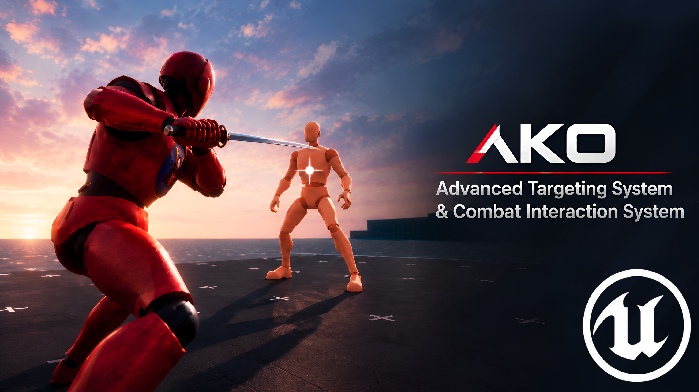

# ako Lock On Target

A <mark style="color:green;">**flexible**</mark>**&#x20;**<mark style="color:$success;">**combat targeting framework**</mark> for Unreal Engine that brings together lock-on, target interaction, target management, and customizable combat UI in a reusable system designed to integrate with a <mark style="color:green;">**wide variety**</mark> of <mark style="color:$success;">**gameplay**</mark> experiences.

<figure><figcaption></figcaption></figure>

## What this documentation covers

This documentation is written for users integrating **ako Lock On Target** into an Unreal Engine project. It explains the target-side setup, target-point configuration, reusable UI Data Assets, Status Widgets, world/screen UI settings, status elements, editor preview, common setups, and Blueprint integration responsibilities.

The system is designed so that the **target actor defines what can be targeted**, the **Target UI Data Asset defines how target information is presented**, and your **Blueprint/gameplay logic controls how targeting and gameplay values are driven**.

## Start here

New to the system? Follow this path:

1. [Introduction](/broken/pages/aa7wdxTB61rSMFQzGXXB)
2. [Installation & Project Setup](/broken/pages/MXFNaaMDeNpvHwOqSW97)
3. [Your First Target](/broken/pages/HPU8llUIFTdRoR3JIKL8)
4. [Target Configuration](/broken/pages/S0y0ubuoQ8X2tz4ioozy)
5. [Target UI Data Assets](/broken/pages/hkmobgvSXBUxznltKA6x)
6. [Choose a UI Workflow](/broken/pages/fXOsq7SyKYraXRyVu2QR)

## System at a glance

```
Target Actor
    │
    └── Lock-On Target Component
            │
            ├── Target Point / Bones
            ├── Lock-On Icon
            └── UI Target Settings
                    │
                    ▼
            Target UI Data Asset
                    │
                    ├── Custom Widget
                    └── Status Widget
                            │
                            └── Status Elements
```

## Documentation structure

* **Getting Started** — install the plugin and build your first configured target.
* **Core Concepts** — understand how the main pieces fit together.
* **Target Configuration** — configure skeletons, target points, bones, and icons.
* **Target UI** — create reusable UI Data Assets and configure screen/world presentation.
* **Status System** — build progress, segmented, and text-based target information.
* **Editor Preview** — use the built-in preview to refine target UI layouts.
* **Examples** — standard enemies, bosses, bone-based targeting, segmented health, and custom UI.
* **Troubleshooting** — common configuration issues and their fixes.
* **Reference** — compact reference tables for the main settings.

## Important integration note

The system is designed to work alongside your own Blueprint/gameplay logic. Target acquisition, input handling, camera behavior, health/stamina/shield values, and other project-specific gameplay rules are not tied to one mandatory gameplay architecture.
