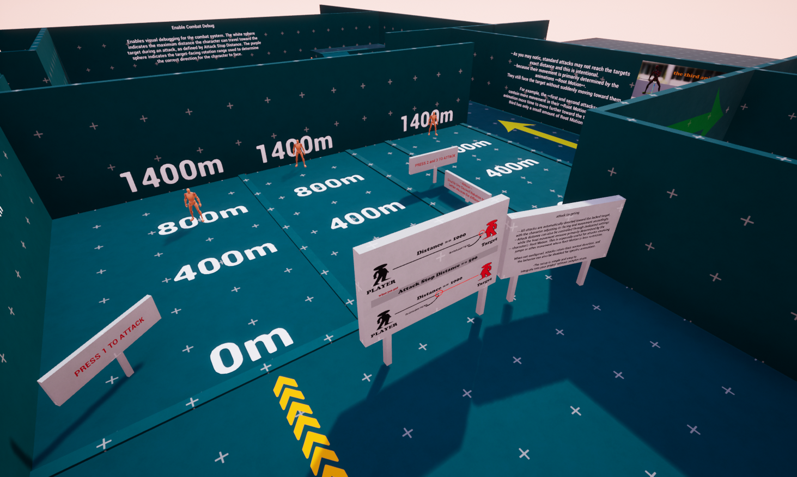
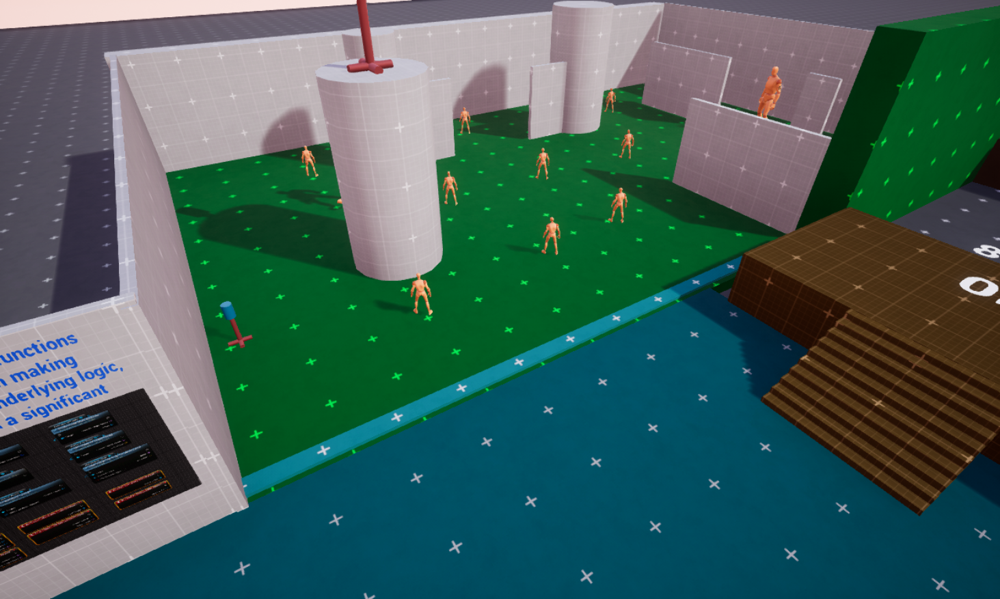

# 📁 Example Content

### <mark style="color:cyan;">📁 Included Example</mark> 

A ready-to-use <mark style="color:blue;">**Demo**</mark> is included so you can explore the system's features **directly**, test the targeting and combat interactions, and see <mark style="color:$success;">**How the Lock-On System Works.**</mark>

<figure><figcaption></figcaption></figure> <figure><figcaption></figcaption></figure>

### <mark style="color:red;">See the system in action before you commit</mark>

> ### [<mark style="color:$success;">**`you can download the demo from here`**</mark>](https://drive.google.com/file/d/14vvZOCJj8q4yAbAnyOfR9AdaD88XuUn9/view?usp=sharing)

