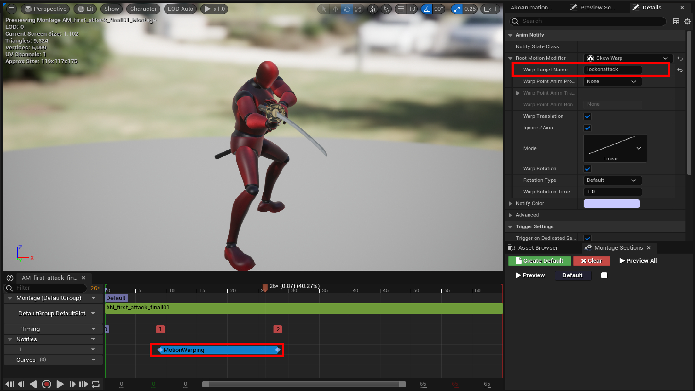
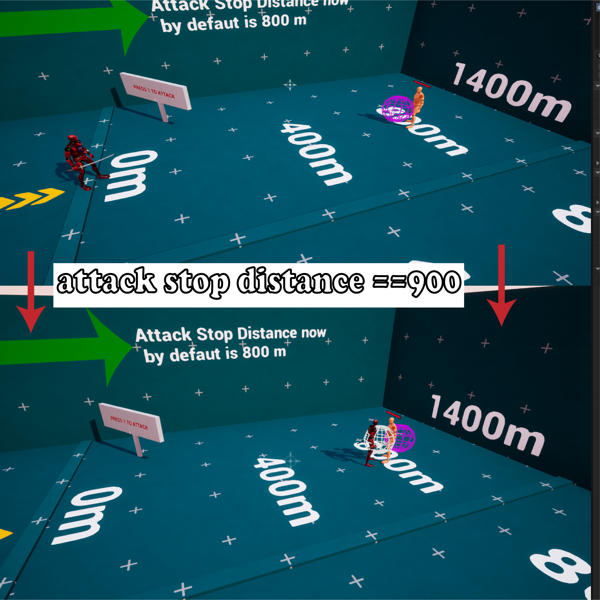
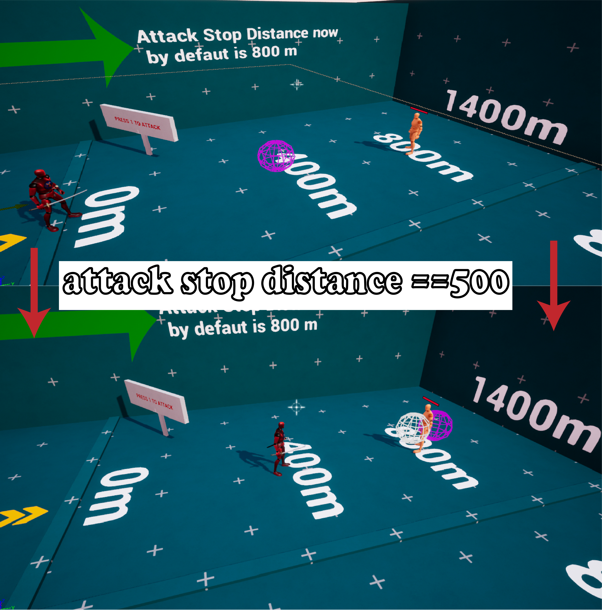
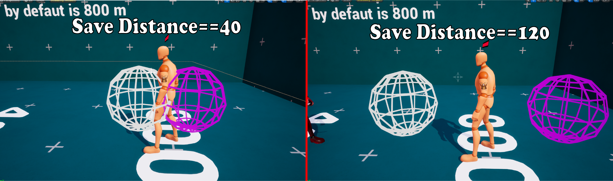

# Combat Targeting Settings

> #### <mark style="color:orange;">The</mark> <mark style="color:orange;"></mark><mark style="color:orange;">**Combat Targeting Settings**</mark> <mark style="color:orange;"></mark><mark style="color:orange;">section controls how the Lock-On system behaves during combat, particularly when switching targets after a target is lost and when using</mark> <mark style="color:orange;"></mark><mark style="color:orange;">**Motion Warping**</mark> <mark style="color:orange;"></mark><mark style="color:orange;">for attacks.</mark>

These settings allow you to control how attacks move toward the target, how close the character can get, how the character <mark style="color:green;">**faces**</mark> the target, and whether attacks <mark style="color:green;">**can track moving**</mark> targets.

### <mark style="color:$primary;">00- Enable Combat Debug</mark>

**Enables visual debugging for the combat targeting system.**

When enabled, the system displays visual indicators that help you understand the combat targeting and Motion Warping ranges.

* **White Sphere** — Shows the maximum distance the character can travel toward the target during an attack, based on **Attack Stop Distance**.
* <mark style="color:purple;">**Purple Sphere**</mark> — Shows the target-facing rotation range used to determine the direction the character should face.

#### <mark style="color:cyan;">1- Auto Switch Target On Death</mark>

**Automatically switches to another valid target when the current target dies.**

When <mark style="color:$success;">**enabled**</mark>, the system can automatically search for and switch to another available target after the current target is no longer valid.

<figure><figcaption></figcaption></figure>

This requires the target to have the required additional settings configured correctly. \
\
<mark style="color:$warning;">**Required Setup**</mark>

When the NPC dies — for example, when its Health reaches **0** — set the **`Is Dead`** variable FROM **`Cus_Setting`** to **`True`**. 

<figure><figcaption></figcaption></figure>

Once `Is Dead` is set to `True`, the target is considered dead and **cannot be selected or locked onto again**.

This allows the Lock-On system to recognize that the current target is no longer valid and switch to another available target when **Auto Switch Target On Death** is enabled.

***

#### <mark style="color:violet;">2- Warp Target Name</mark>

**Defines the Warp Target Name used by Motion Warping to move attacks toward the current Lock-On Target.**

The name entered here <mark style="color:$danger;">**must match**</mark> the Warp Target Name used by the corresponding Motion Warping setup in your attack animation.

This allows the character's attack to align and move toward the current target.

<figure><figcaption></figcaption></figure>

> <mark style="color:$danger;">**Requirements:**</mark> The **Motion Warping** plugin must be enabled, and **Root Motion** must be enabled in the animation.

***

#### <mark style="color:violet;">**3- Attack Stop Distance**</mark>

**Defines the maximum distance the character can travel toward the target during an attack using Motion Warping.**

This limits how far the character is allowed to move toward the target during the attack.

<figure><figcaption></figcaption></figure> <figure><figcaption></figcaption></figure>

***

#### <mark style="color:violet;">4-Save Distance</mark>

**Defines the distance that should be maintained between the character and the target during an attack.**

<figure><figcaption></figcaption></figure>

This prevents the character from moving directly into the target and helps <mark style="color:$warning;">reduce</mark> character <mark style="color:$warning;">overlap</mark> and unwanted rotation issues during attacks.

***

#### <mark style="color:violet;">5- Target Facing Speed</mark>

**Defines how quickly the character rotates to face the target when using Motion Warping.**

Higher values make the character rotate toward the target <mark style="color:$success;">faster</mark>, while lower values produce a <mark style="color:$success;">slower</mark> rotation.

***

#### <mark style="color:violet;">6- Track Moving Target</mark>

**Enables the attack to continuously track the target's position while the attack is playing.**

When enabled, the system continuously updates the attack target location as the target moves, allowing the character to follow the target's updated position throughout the attack.

When this option is enabled, **Attack Stop Distance no longer limits the attack's travel distance**.

***
