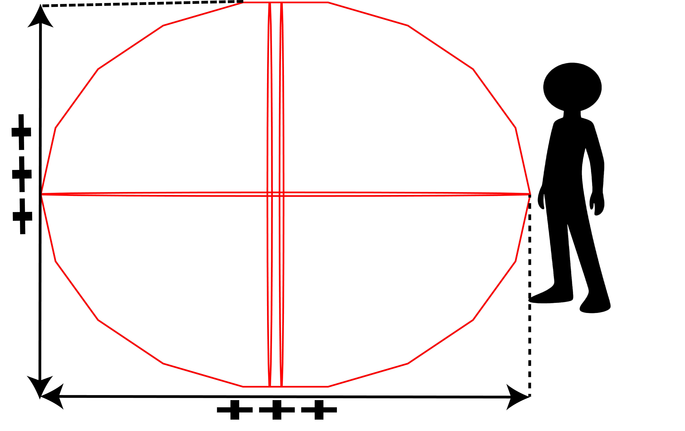
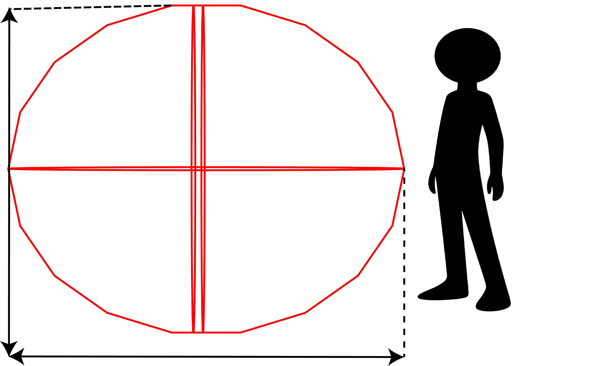
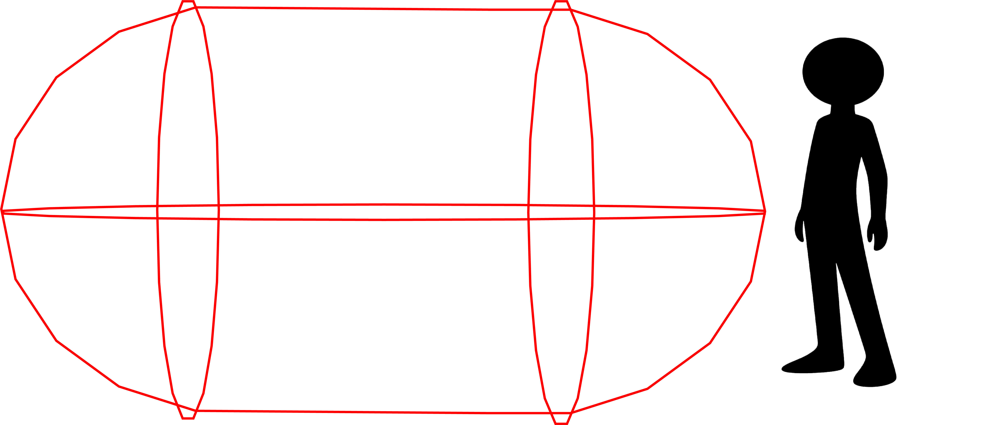
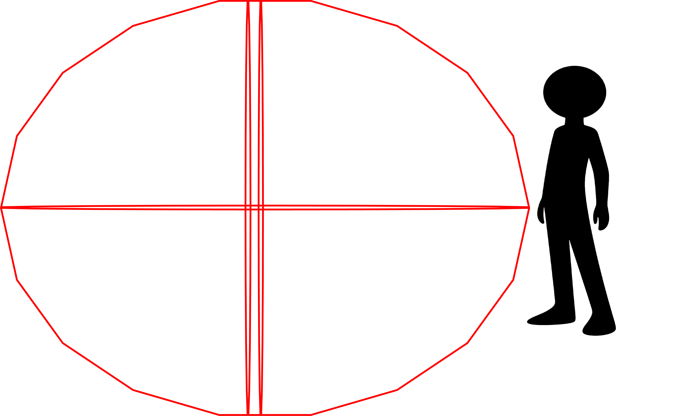
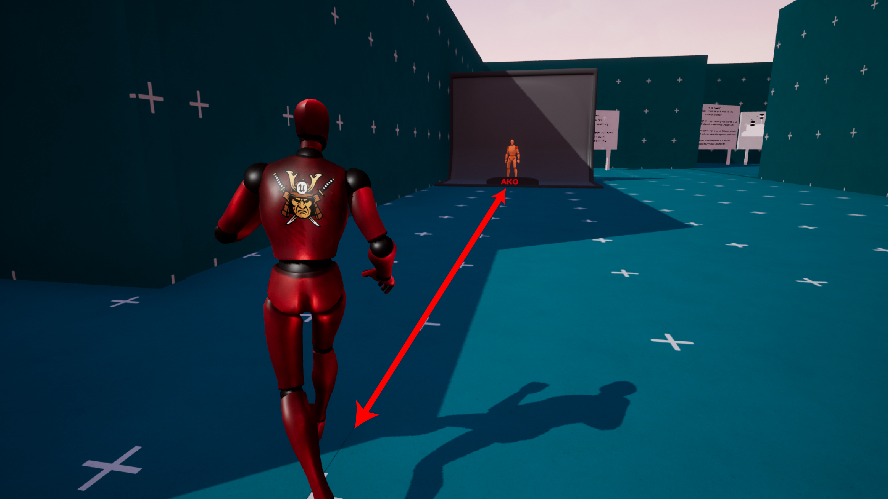
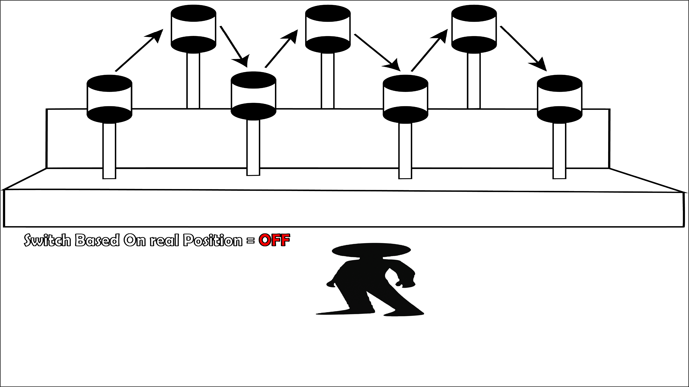
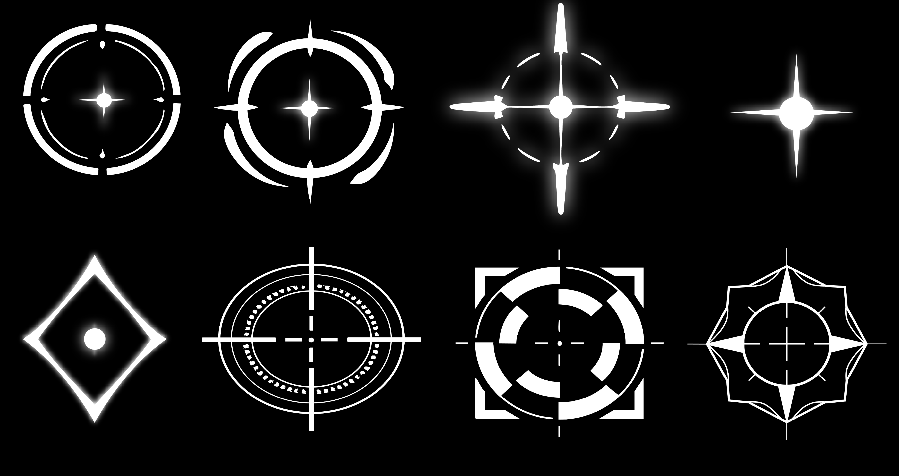

# Targeting Settings

> #### <mark style="color:green;">The</mark> <mark style="color:green;"></mark><mark style="color:green;">**Targeting Settings**</mark> <mark style="color:green;"></mark><mark style="color:green;">section contains the</mark> <mark style="color:$success;">main settings</mark> <mark style="color:green;">that control how the Lock-On Target system detects, selects, switches, and maintains targets.</mark>

> #### <mark style="color:green;">And These settings determine which Actors can be considered as targets, how far the system searches, how targets are selected, and when the Lock-On should be maintained or cancelled.</mark>

#### <mark style="color:yellow;">**1- Target Object Types**</mark>

**Use this setting to define which Object Types the Lock-On system can interact with.**

Any Actor using one of the selected Object Types can be considered a potential Lock-On Target.

By default, this is set to <mark style="color:$success;">**Pawn**</mark>, meaning Actors using the Pawn Object Type can be detected as potential targets.

You can add <mark style="color:$success;">**multiple Object Types**</mark> when you want the system to recognize different **Object Types** as valid targets.

***

#### <mark style="color:yellow;">**2- Detection Radius**</mark>

**Defines the radius of the area used to search for potential targets.**

Actors located inside this detection area can be considered by the Lock-On system and then evaluated by the other targeting checks.

A larger radius allows the system to search a wider area around the player, while a smaller radius limits the search area.

<figure><figcaption></figcaption></figure> <figure><figcaption></figcaption></figure>

***

#### <mark style="color:yellow;">3- Detection Distance</mark>

**Defines how far forward the detection trace extends when searching for targets.**

This controls the forward reach of the targeting detection and works together with the Detection Radius to determine the area in which potential targets can be found.

<figure><figcaption></figcaption></figure> <figure><figcaption></figcaption></figure>

***

#### <mark style="color:yellow;">**4- Max Lock On Distance**</mark>

**Defines the maximum distance a target can be from the player while remaining locked on.**

When the currently locked target moves **beyond this distance**, the Lock-On will be **broken** and the target will be unlocked <mark style="color:$success;">**automatically**</mark>.

This setting controls the distance at which an already selected target can no longer be maintained.

<figure><figcaption></figcaption></figure>

***

#### <mark style="color:yellow;">**5- Check Obstruction OnTarget**</mark>

**Checks whether the current target is obstructed by another object, such as a wall or other obstacle.**

When the target is blocked from the player, it cannot be selected or switched to.

> <mark style="color:$danger;">**Important:**</mark> <mark style="color:$warning;">For the current version, it is recommended to keep this option</mark> <mark style="color:$danger;">**enabled at all times**</mark><mark style="color:$danger;">.</mark>

<figure><figcaption></figcaption></figure> <figure><figcaption></figcaption></figure>

\--When an obstruction is detected while already locked on, **you can choose how the system should respond** by using <mark style="color:$success;">**Auto Switch Target on LOSE It**</mark>. When <mark style="color:$danger;">**enabled**</mark>, the system can automatically switch to another valid target. When <mark style="color:$danger;">**disabled**</mark>, the system will automatically **Unlock** after the duration specified by <mark style="color:$success;">**Time To Unlock on Lose Target**</mark>.

&#x20;<mark style="color:red;">**\*\*\* Auto Switch Target On LOSE it**</mark>\
&#x20;        Automatically switches to another target when the current one is lost.The rate of <mark style="color:red;">**Switch**</mark> is affected by **`Time to Unlock on Lost Target`**

&#x20;    <mark style="color:red;">**\*\*\* Time to Unlock on Lost Target**</mark>

&#x20;        **Defines how long the system should wait before unlocking a target after its visibility is lost.**

For example, when a wall or another obstacle blocks the current target, the Lock-On does not have to be removed immediately. The system waits for the specified amount of time while the obstruction remains.

If the target is still obstructed after this delay, the Lock-On is cancelled and the target is unlocked.

This allows you to prevent the Lock-On from being lost instantly when the target is only briefly hidden.

***

#### <mark style="color:yellow;">**6- Check Obstruction OnBone**</mark>

**Checks whether the currently selected target bone is obstructed by another object.**

If the selected bone is blocked, that bone cannot be used as the active Lock-On point. This also prevents targets or target points that are behind an obstacle from being switched to.

This setting is particularly relevant when using the system's **Target Bone Switching** functionality.

***

#### <mark style="color:yellow;">**7- Use Switch Based On Real Position**</mark>

**Determines how the system chooses a new target when switching between targets using left/right OR UP/DOWN directional input.**

When <mark style="color:$success;">**enabled**</mark>, target switching is based on the target's <mark style="color:blue;">**actual world position**</mark>.

For example, when switching to the right, the system looks for a suitable target that is physically located to the right of the current target in the game world.

<figure><figcaption></figcaption></figure>

When <mark style="color:$success;">**disabled**</mark>, switching is based on the target's <mark style="color:$warning;">**screen position relative to the camera.**</mark> In this case, the system considers whether a target appears to the left or right on the screen, regardless of its actual world position.

<figure><figcaption></figcaption></figure>

#### This option lets you choose whether directional target switching should follow the <mark style="color:$success;">**physical world position**</mark> of targets or how they <mark style="color:$success;">**appear on screen**</mark>.

***

#### <mark style="color:yellow;">**8- Target Icon Size**</mark>

**Defines the size of the Target Icon displayed on a locked target.**

This value controls the base size of the icon when it is displayed.

Individual targets can override this value through their own **`Cus_Setting`** configuration when you want a specific target to use a different icon size.

<figure><figcaption></figcaption></figure> <figure><figcaption></figcaption></figure>

***

#### <mark style="color:yellow;">**9- Icon Target**</mark>

**Defines the default icon displayed on a target when it is locked on.**

This icon is used by default for targets that do not provide their own custom icon.

You can override this setting for individual targets using **`Cus_Setting`**, allowing different targets to display different Lock-On icons.\
\
**and the system includes
&#x20;more than&#x20;**<mark style="color:$success;">**8 preset icons**</mark>**&#x20;ready to use.**

<figure><figcaption></figcaption></figure>

***

#### <mark style="color:yellow;">**10- Min Icon Target Scale**</mark>

**Defines the minimum scale the Target Icon can reach as the distance from the target increases.**

As the target becomes farther away, the icon can scale down according to the system's distance-based scaling behavior. This setting defines the smallest scale the icon is allowed to reach.

* **Higher values** = The icon remains larger at greater distances.
* **Lower values** = The icon can become smaller at greater distances.

***

#### <mark style="color:yellow;">**11- Auto Lock On Target**</mark>

**Enables automatic target selection and target switching.**

When <mark style="color:$success;">**enabled**</mark>, the system can automatically acquire a target and switch between available targets based on **where the&#x20;**<mark style="color:$success;">**camera is looking**</mark><mark style="color:$success;">.</mark>

The target with the position closest to the **center of the screen / camera view** is prioritized. This allows the system to naturally select or switch to the target you are currently looking toward.

> <mark style="color:orange;">**Important:**</mark> <mark style="color:orange;"></mark><mark style="color:orange;">Auto target selection does</mark> <mark style="color:orange;"></mark><mark style="color:orange;">**not**</mark> <mark style="color:orange;"></mark><mark style="color:orange;">automatically switch between target bones. Bone switching remains manual. When a target is first selected, the initial bone is determined by the bone closest to the camera view, following the same camera-based selection logic.</mark>\ <mark style="color:orange;">Manual switching between targets will also become inactive.</mark>

***

***

#### <mark style="color:yellow;">**12- Use Desired Rotation**</mark>

**Determines which character rotation method is used while the Lock-On system controls rotation.**

When <mark style="color:$success;">**enabled**</mark>, the system uses **Desired Rotation**.

When <mark style="color:$success;">**disabled**</mark>, the system uses **Orient Rotation**.

Use the option that matches the rotation setup and behavior of your character.

***

#### <mark style="color:yellow;">**13- Enable Stable Camera**</mark>

**Determines how the camera behaves while Lock-On is active.**

When <mark style="color:$success;">**enabled**</mark>, the camera remains **completely fixed** while the player is locked onto a target.

When <mark style="color:$success;">**disabled**</mark>, the camera uses **smooth movement** while tracking the target, allowing it to adjust naturally during Lock-On.

This gives you the choice between a fully stable camera and a smoother camera-tracking behavior.
