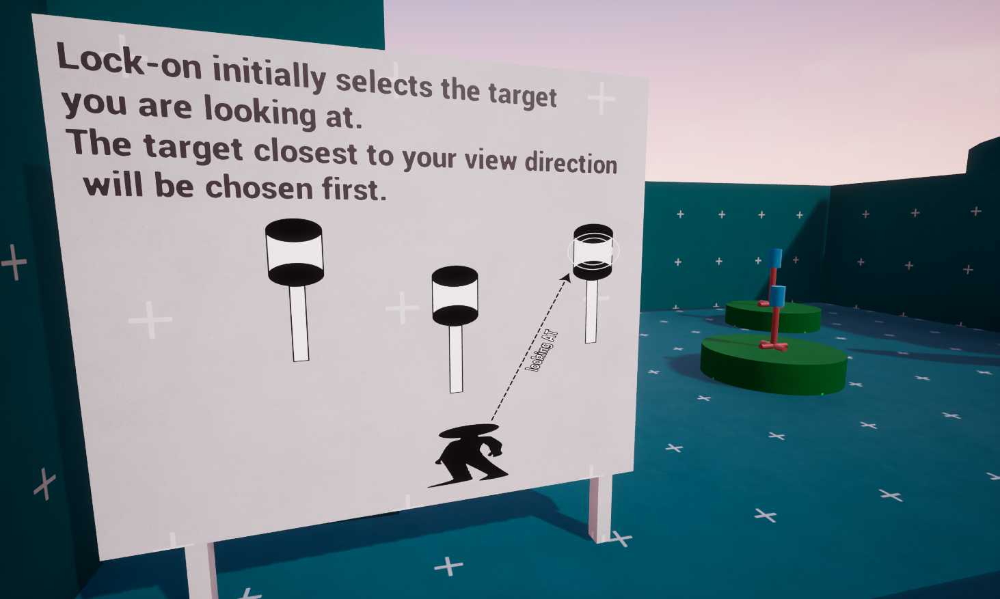

# How the Lock-On System Works

#### The Lock-On system <mark style="color:$danger;">**is not**</mark> based on random target selection. It <mark style="color:$success;">continuously evaluates</mark> the available targets and uses your <mark style="color:$success;">**camera view**</mark>**&#x20;and target position** to determine which target should be selected.

Understanding this basic behavior will help you get the most out of the system before configuring its <mark style="color:$success;">advanced settings</mark>.

### <mark style="color:yellow;">Initial Target Selection</mark>

When Lock-On is activated, the system first looks at the available targets and determines which one is <mark style="color:$success;">**closest to the direction you are looking**</mark>.

<figure><figcaption></figcaption></figure>

This means that the target you are <mark style="color:$success;">**looking toward**</mark> will naturally be prioritized.

The same logic is also used for targets that support <mark style="color:$success;">**Bone-Based Targeting**</mark>.

If the selected target has configured target bones, the system determines which valid bone is <mark style="color:$success;">**closest to your camera view direction**</mark> and uses it as the initial Lock-On point.

This gives you natural control simply by looking at the part of the target you want to focus on.

### <mark style="color:red;">**Core System Behavior**</mark>

The system <mark style="color:$success;">**automatically manages**</mark> the main Lock-On behavior based on your camera view, target position, visibility, and distance.

The <mark style="color:$danger;">**Target Icon**</mark> reacts to both distance and visibility: it can become smaller as the target moves farther away and more transparent when the player blocks it, while you can fully customize its icon, size, scaling, and per-target or per-bone appearance.

The <mark style="color:$warning;">**Lock-On Point**</mark> can be controlled using the target center, a custom height, a specific bone, or dynamic bone switching, giving you full control over where the system focuses.

The system also performs <mark style="color:violet;">**obstruction and distance checks**</mark> to prevent invalid Lock-On states. You can control the detection radius, maximum Lock-On distance, obstruction behavior, and whether the system should switch to another target or unlock after losing visibility.

For <mark style="color:$primary;">**Target UI**</mark>, you can control how and where it is displayed, including screen or world space, position, rotation, scale, pivot, and draw size.

During <mark style="color:cyan;">**combat**</mark>, the system can control attack movement toward the locked target, target-facing rotation, stopping distance, moving-target tracking, and automatic target switching when a target is defeated.

Together, these settings give you direct control over how the Lock-On system behaves, looks, and interacts with your gameplay.

#### **The important part is that these behaviors&#x20;**<mark style="color:$success;">**are configurable.**</mark>**&#x20;You can adjust the targeting range, obstruction checks, Lock-On distance, target point, bone selection, Target Icon behavior, UI placement, and combat interaction to&#x20;**<mark style="color:$danger;">**fit**</mark>**&#x20;the needs of your&#x20;**<mark style="color:$danger;">**own game**</mark>**.**
